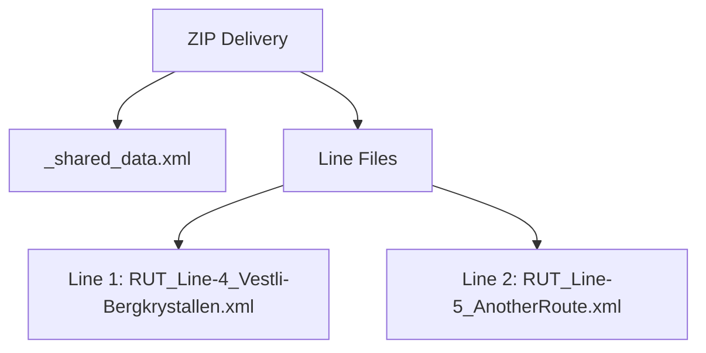
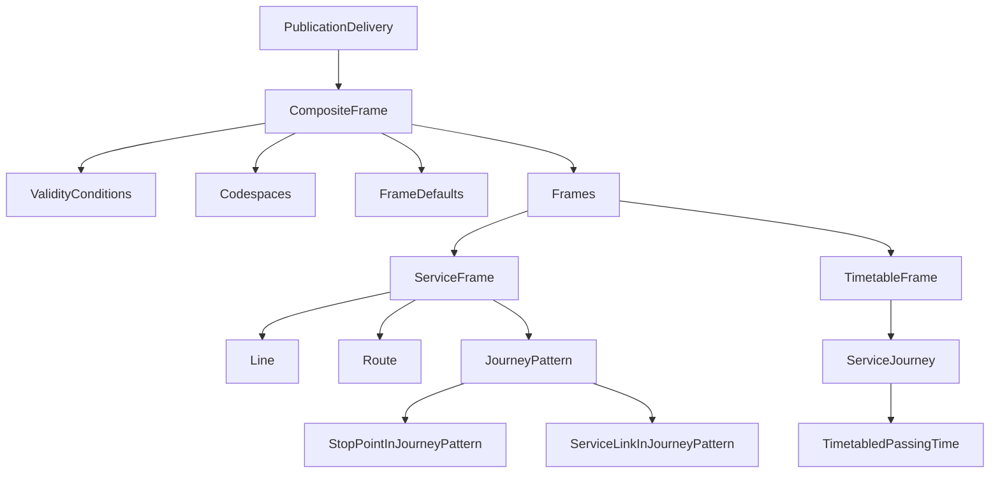

# Beginner’s Guide: Using Dated Service Journey Files

## 1. Introduction
Timetable data is delivered as a **ZIP file** containing:
- **One shared file**: `_shared_data.xml` (common info for all lines)
- **One file per line**: `<CODESPACE>_<LINE NAME>.xml`

---

## 2. File Structure Diagram


---

## 3. PublicationDelivery
| Field               | Type       | Required | Description                                      |
|---------------------|-----------|----------|--------------------------------------------------|
| PublicationTimestamp| datetime  | Yes      | When dataset was published                      |
| ParticipantRef      | string    | Yes      | Publisher identifier (codespace)                |
| Description         | string    | No       | Human-readable description                       |
| dataObjects         | CompositeFrame | Yes | Main dataset container                          |

**Example:**
```xml
<PublicationDelivery>
  <PublicationTimestamp>2024-07-09T00:03:30.985</PublicationTimestamp>
  <ParticipantRef>RB</ParticipantRef>
  <Description>Vestvollen - Økern</Description>
  <dataObjects>...</dataObjects>
</PublicationDelivery>
```

---

## 4. CompositeFrame
| Field             | Type            | Required | Description                     |
|-------------------|---------------|----------|---------------------------------|
| id               | string         | Yes      | Unique ID                      |
| version          | string         | Yes      | Version                        |
| created          | datetime       | Yes      | Creation timestamp             |
| validityConditions| AvailabilityCondition | Yes | Validity period               |
| codespaces       | Codespace[]    | Yes      | Namespace definitions          |
| FrameDefaults    | DefaultLocale  | Yes      | Timezone & language            |
| frames           | ServiceFrame, TimetableFrame | Yes | Network & timetable data |

**Example:**
```xml
<CompositeFrame id="RUT:CompositeFrame:5336146" version="1">
  <validityConditions>...</validityConditions>
  <codespaces>...</codespaces>
  <FrameDefaults>...</FrameDefaults>
  <frames>...</frames>
</CompositeFrame>
```

---

## 5. AvailabilityCondition
| Field    | Type     | Required | Description          |
|----------|---------|----------|----------------------|
| id       | string  | Yes      | Condition ID         |
| version  | string  | Yes      | Version             |
| FromDate | datetime| Yes      | Start of validity    |
| ToDate   | datetime| Yes      | End of validity      |

**Example:**
```xml
<AvailabilityCondition id="RUT:AvailabilityCondition:5336010" version="1">
  <FromDate>2024-07-07T00:00:00</FromDate>
  <ToDate>2025-07-09T00:00:00</ToDate>
</AvailabilityCondition>
```

---

## 6. Codespace
**Example:**
```xml
<Codespace id="rut">
  <Xmlns>RUT</Xmlns>
  <XmlnsUrl>http://www.rutebanken.org/ns/rut</XmlnsUrl>
</Codespace>
```

---

## 7. DefaultLocale
**Example:**
```xml
<DefaultLocale>
  <TimeZone>Europe/Oslo</TimeZone>
  <DefaultLanguage>no</DefaultLanguage>
</DefaultLocale>
```

---

## 8. ServiceFrame
**Example:**
```xml
<ServiceFrame id="RUT:ServiceFrame:5336147" version="1">
  <lines>...</lines>
  <routes>...</routes>
  <journeyPatterns>...</journeyPatterns>
</ServiceFrame>
```

---

### 8.1 Line
**Example:**
```xml
<Line id="RUT:Line:345" version="20240704103000">
  <Name>Vestvollen - Økern</Name>
  <PublicCode>345</PublicCode>
  <TransportMode>bus</TransportMode>
</Line>
```

---

### 8.2 Route
**Example:**
```xml
<Route id="RUT:Route:002807">
  <Name>Vestvollen-Økern T</Name>
  <LineRef ref="RUT:Line:345"/>
  <DirectionType>inbound</DirectionType>
</Route>
```

---

### 8.3 JourneyPattern
**Example:**
```xml
<JourneyPattern id="RUT:JourneyPattern:002807">
  <Name>Vestvollen-Økern T</Name>
  <RouteRef ref="RUT:Route:002807"/>
</JourneyPattern>
```

---

## 9. StopPointInJourneyPattern
**Example:**
```xml
<StopPointInJourneyPattern id="RUT:StopPointInJourneyPattern:002807-1" order="1">
  <ScheduledStopPointRef ref="RUT:ScheduledStopPoint:8203"/>
</StopPointInJourneyPattern>
```

---

## 10. ServiceLinkInJourneyPattern
**Example:**
```xml
<ServiceLinkInJourneyPattern id="RUT:ServiceLinkInJourneyPattern:5336060" order="1">
  <ServiceLinkRef ref="RUT:ServiceLink:8203-8206"/>
</ServiceLinkInJourneyPattern>
```

---

## 11. TimetableFrame
**Example:**
```xml
<TimetableFrame id="RUT:TimetableFrame:5336148" version="1">
  <vehicleJourneys>...</vehicleJourneys>
</TimetableFrame>
```

---

## 12. ServiceJourney
**Example:**
```xml
<ServiceJourney id="RUT:ServiceJourney:0580df46319ea778c4fb618f27330033">
  <Name>Økern</Name>
  <JourneyPatternRef ref="RUT:JourneyPattern:002807"/>
  <LineRef ref="RUT:Line:345"/>
</ServiceJourney>
```

---

## 13. TimetabledPassingTime
**Example:**
```xml
<TimetabledPassingTime id="RUT:TimetabledPassingTime:001" version="1">
  <StopPointInJourneyPatternRef ref="RUT:StopPointInJourneyPattern:002807-1"/>
  <DepartureTime>08:49:00</DepartureTime>
</TimetabledPassingTime>
```

---

## ✅ Full Hierarchy Diagram

