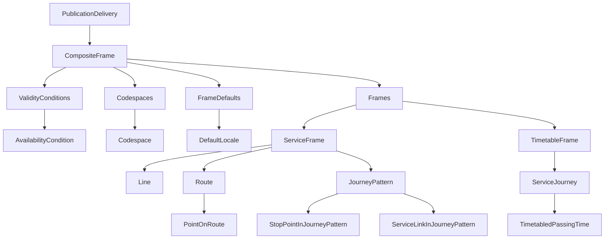

# Introduction
This guide describe the content of the files within zip file with timetable data, one line per file

---

# 🧱 1. Hierarchical Structure
```
PublicationDelivery  →  [2]
└── CompositeFrame  →  [3]
    ├── ValidityConditions → AvailabilityCondition [4]
    ├── Codespaces → Codespace [5]
    ├── FrameDefaults → DefaultLocale [6]
    └── Frames
        ├── ServiceFrame → [7]
        │   ├── Line → [8]
        │   ├── Route → [9]
        │   │   └── PointOnRoute → [10]
        │   └── JourneyPattern → [11]
        │       ├── StopPointInJourneyPattern → [12]
        │       └── ServiceLinkInJourneyPattern → [13]
        └── TimetableFrame → [14]
            └── ServiceJourney → [15]
                └── TimetabledPassingTime → [16]
```



---

# 🧩 2. PublicationDelivery  {#2}

All files should be wrappen inside a PublicationDelivery, more information about PublicationDelivery is found [here](/01-Frames/PublicationDelivery.md)

| Element | Type | Required | Description |
|--------|-------|----------|-------------|
| PublicationTimestamp | datetime | Yes | data extraction time |
| ParticipantRef | string | Yes | Publisher identifier (codespace for data submitter) |
| Description | string | No | Human-readable description |
| dataObjects | CompositeFrame | Yes | Main dataset container |

### Example XML
```xml
<PublicationDelivery>
  <PublicationTimestamp>2024-07-09T00:03:30.985</PublicationTimestamp>
  <ParticipantRef>RB</ParticipantRef>
  <Description>Vestvollen - Økern</Description>
  <dataObjects>...</dataObjects>
</PublicationDelivery>
```

---

# 🧩 3. CompositeFrame  {#3}


| Element | Type | Required | Description |
|--------|-------|----------|-------------|
| id | string | Yes | Unique ID |
| version | string | Yes | Version |
| created | datetime | Yes | Creation timestamp |
| validityConditions | AvailabilityCondition | Yes | Validity period |
| codespaces | Codespace[] | Yes | Namespace definitions |
| FrameDefaults | DefaultLocale | Yes | Timezone & language |
| frames | (ServiceFrame, TimetableFrame) | Yes | Network & timetable data |

### Example XML
```xml
<CompositeFrame id="RUT:CompositeFrame:5336146" version="1">
  <validityConditions>...</validityConditions>
  <codespaces>...</codespaces>
  <FrameDefaults>...</FrameDefaults>
  <frames>...</frames>
</CompositeFrame>
```

---

# 🧩 4. AvailabilityCondition  {#4}

| Element | Type | Required | Description |
|--------|-------|----------|-------------|
| id | string | Yes | Condition ID |
| version | string | Yes | Version |
| FromDate | datetime | Yes | Start of validity |
| ToDate | datetime | Yes | End of validity |

### Example XML
```xml
<AvailabilityCondition id="RUT:AvailabilityCondition:5336010" version="1">
  <FromDate>2024-07-07T00:00:00</FromDate>
  <ToDate>2025-07-09T00:00:00</ToDate>
</AvailabilityCondition>
```

---

# 🧩 5. Codespace  {#5}

| Element | Type | Required | Description |
|--------|-------|----------|-------------|
| id | string | Yes | Namespace ID |
| Xmlns | string | Yes | Prefix |
| XmlnsUrl | string | Yes | Namespace URL |

### Example XML
```xml
<Codespace id="rut">
  <Xmlns>RUT</Xmlns>
  <XmlnsUrl>http://www.rutebanken.org/ns/rut</XmlnsUrl>
</Codespace>
```

---

# 🧩 6. DefaultLocale  {#6}

| Element | Type | Required | Description |
|--------|-------|----------|-------------|
| TimeZone | string | Yes | Default timezone |
| DefaultLanguage | string | Yes | Language code |

### Example XML
```xml
<DefaultLocale>
  <TimeZone>Europe/Oslo</TimeZone>
  <DefaultLanguage>no</DefaultLanguage>
</DefaultLocale>
```

---

# 🚌 7. ServiceFrame  {#7}

| Element | Type | Required | Description |
|--------|-------|----------|-------------|
| id | string | Yes | Frame ID |
| version | string | Yes | Version |
| lines | Line[] | Yes | Line definitions |
| routes | Route[] | Yes | Route definitions |
| journeyPatterns | JourneyPattern[] | Yes | Stop sequences & links |

### Example XML
```xml
<ServiceFrame id="RUT:ServiceFrame:5336147" version="1">
  <lines>...</lines>
  <routes>...</routes>
  <journeyPatterns>...</journeyPatterns>
</ServiceFrame>
```

---

# 🧩 8. Line  {#8}

| Element | Type | Required | Description |
|--------|-------|----------|-------------|
| id | string | Yes | Line ID |
| version | string | Yes | Version |
| Name | string | Yes | Name |
| PublicCode | string | Yes | Public-facing number |
| TransportMode | string | Yes | Transport mode |
| TransportSubmode | string | No | Submode |
| OperatorRef | string | Yes | Operator |
| Presentation | object | No | Color styling |

### Example XML
```xml
<Line id="RUT:Line:345" version="20240704103000">
  <Name>Vestvollen - Økern</Name>
  <PublicCode>345</PublicCode>
  <TransportMode>bus</TransportMode>
</Line>
```

---

# 🧭 9. Route  {#9}

| Element | Type | Required | Description |
|--------|-------|----------|-------------|
| id | string | Yes | Route ID |
| version | string | Yes | Version |
| Name | string | Yes | Name |
| LineRef | reference | Yes | Points to Line |
| DirectionType | string | Yes | inbound/outbound |
| pointsInSequence | PointOnRoute[] | Yes | Stop geometry sequence |

### Example XML
```xml
<Route id="RUT:Route:002807">
  <Name>Vestvollen-Økern T</Name>
  <LineRef ref="RUT:Line:345"/>
  <DirectionType>inbound</DirectionType>
</Route>
```

---

# 📍 10. PointOnRoute  {#10}

| Element | Type | Required | Description |
|--------|-------|----------|-------------|
| id | string | Yes | ID |
| order | integer | Yes | Order in sequence |
| RoutePointRef | reference | Yes | Reference to stop point |

### Example XML
```xml
<PointOnRoute id="RUT:PointOnRoute:5336011" order="1">
  <RoutePointRef ref="RUT:RoutePoint:8203"/>
</PointOnRoute>
```

---

# 🚌 11. JourneyPattern  {#11}

| Element | Type | Required | Description |
|--------|-------|----------|-------------|
| id | string | Yes | Pattern ID |
| version | string | Yes | Version |
| Name | string | Yes | Name |
| RouteRef | reference | Yes | Associated route |
| pointsInSequence | StopPointInJourneyPattern[] | Yes | Ordered stop list |
| linksInSequence | ServiceLinkInJourneyPattern[] | Yes | Ordered service links |

### Example XML
```xml
<JourneyPattern id="RUT:JourneyPattern:002807">
  <Name>Vestvollen-Økern T</Name>
  <RouteRef ref="RUT:Route:002807"/>
</JourneyPattern>
```

---

# 🚏 12. StopPointInJourneyPattern  {#12}

| Element | Type | Required | Description |
|--------|-------|----------|-------------|
| id | string | Yes | Stop-point ID |
| order | integer | Yes | Order |
| ScheduledStopPointRef | reference | Yes | Stop point |
| ForBoarding | boolean | No | Boarding allowed |
| ForAlighting | boolean | No | Alighting allowed |

### Example XML
```xml
<StopPointInJourneyPattern id="RUT:StopPointInJourneyPattern:002807-1" order="1">
  <ScheduledStopPointRef ref="RUT:ScheduledStopPoint:8203"/>
</StopPointInJourneyPattern>
```

---

# 🔗 13. ServiceLinkInJourneyPattern  {#13}

| Element | Type | Required | Description |
|--------|-------|----------|-------------|
| id | string | Yes | ID |
| order | integer | Yes | Order |
| ServiceLinkRef | reference | Yes | Service link ID |

### Example XML
```xml
<ServiceLinkInJourneyPattern id="RUT:ServiceLinkInJourneyPattern:5336060" order="1">
  <ServiceLinkRef ref="RUT:ServiceLink:8203-8206"/>
</ServiceLinkInJourneyPattern>
```

---

# 🗓 14. TimetableFrame  {#14}

| Element | Type | Required | Description |
|--------|-------|----------|-------------|
| id | string | Yes | Frame ID |
| version | string | Yes | Version |
| vehicleJourneys | ServiceJourney[] | Yes | List of trips |

### Example XML
```xml
<TimetableFrame id="RUT:TimetableFrame:5336148" version="1">
  <vehicleJourneys>...</vehicleJourneys>
</TimetableFrame>
```

---

# 🚌 15. ServiceJourney  {#15}

| Element | Type | Required | Description |
|--------|-------|----------|-------------|
| id | string | Yes | Journey ID |
| version | string | Yes | Version |
| Name | string | Yes | Trip name |
| PrivateCode | string | No | Internal trip code |
| JourneyPatternRef | reference | Yes | Pattern (→ 11) |
| LineRef | reference | Yes | Line (→ 8) |
| OperatorRef | reference | Yes | Operator |
| passingTimes | TimetabledPassingTime[] | Yes | Stop times |

### Example XML
```xml
<ServiceJourney id="RUT:ServiceJourney:0580df46319ea778c4fb618f27330033">
  <Name>Økern</Name>
  <JourneyPatternRef ref="RUT:JourneyPattern:002807"/>
</ServiceJourney>
```

---

# 🕒 16. TimetabledPassingTime  {#16}

| Element | Type | Required | Description |
|--------|-------|----------|-------------|
| id | string | Yes | Time entry ID |
| version | string | Yes | Version |
| StopPointInJourneyPatternRef | reference | Yes | Stop reference |
| ArrivalTime | time | No | Arrival |
| DepartureTime | time | No | Departure |

### Example XML
```xml
<TimetabledPassingTime id="RUT:TimetabledPassingTime:...">
  <StopPointInJourneyPatternRef ref="RUT:StopPointInJourneyPattern:002807-1"/>
  <DepartureTime>08:49:00</DepartureTime>
</TimetabledPassingTime>
```

