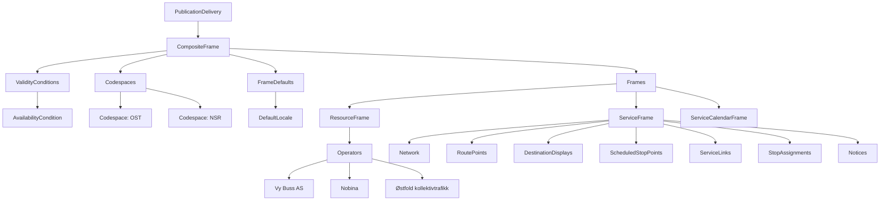

# Introduction
This guide describe the content of the shared file within zip file describing shared content.



## PublicationDelivery

| Field                | Type | Mandatory | Description                                            |
| -------------------- | ---- | --------- | ------------------------------------------------------ |
| PublicationTimestamp |      | **YES**   | The time and date when this dataset has been published |
| ParticipantRef       |      |           |                                                        |
| Description          |      | **NO(?)** | Description of the content of this document            |
| dataObjects          |      | **YES**   | dataObjects contains the CompositFrame with all the frames, see below for details |

---

## Example
The example below shows an overview of a PublicationDelivery. Details for each frame and object are provided below.
<details>
<summary>
  <b>Extend to see an simpliefied example of Publidcation Delivery</b>
</summary>


```xml
<?xml version="1.0" encoding="UTF-8"?>
<PublicationDelivery xmlns="http://www.netex.org.uk/netex" xmlns:gis="http://www.opengis.net/gml/3.2" xmlns:siri="http://www.siri.org.uk/siri" version="1.15:NO-NeTEx-networktimetable:1.5">
    <PublicationTimestamp>2024-07-09T00:05:56.554</PublicationTimestamp>
    <ParticipantRef>RB</ParticipantRef>
    <Description>Shared data used across line files</Description>
    <dataObjects>
        <CompositeFrame created="2024-07-04T13:02:15.812" version="1" id="RUT:CompositeFrame:5395315">
            <validityConditions>
                <AvailabilityCondition version="1" id="RUT:AvailabilityCondition:5395311"></AvailabilityCondition>
            </validityConditions>
            <codespaces>
                <Codespace id="rut">
                    <Xmlns></Xmlns>
                    <XmlnsUrl>http://www.rutebanken.org/ns/rut</XmlnsUrl>
                </Codespace>
            </codespaces>
            <FrameDefaults></FrameDefaults>
            <frames>
                <ResourceFrame version="1" id="RUT:ResourceFrame:5395316">
                    <organisations>
                        <Operator version="20240704103000" id="RUT:Operator:160"></Operator>
                        <Authority version="20240704103000" id="RUT:Authority:RUT"></Authority>
                    </organisations>
                </ResourceFrame>
                <ServiceFrame version="1" id="RUT:ServiceFrame:5395317">
                    <Network version="20240704103000" id="RUT:Network:1"></Network>
                    <routePoints>
                        <RoutePoint version="20240704103000" id="RUT:RoutePoint:28482"></RoutePoint>
                    </routePoints>
                    <destinationDisplays>
                        <DestinationDisplay version="1" id="RUT:DestinationDisplay:c3a4377a065fc11c1a7e315936460491"></DestinationDisplay>
                    </destinationDisplays>
                    <scheduledStopPoints>
                        <ScheduledStopPoint version="1" id="RUT:ScheduledStopPoint:6270"></ScheduledStopPoint>
                    </scheduledStopPoints>
                    <serviceLinks>
                        <ServiceLink version="20240704103000" id="RUT:ServiceLink:25707-25718">
                            <FromPointRef ref=""></FromPointRef>
                            <ToPointRef ref=""></ToPointRef>
                        </ServiceLink>
                    </serviceLinks>
                    <stopAssignments>
                        <PassengerStopAssignment order="2966" version="1" id="RUT:PassengerStopAssignment:108842"></PassengerStopAssignment>
                    </stopAssignments>
                    <notices>
                        <Notice version="1" id="RUT:Notice:6a930b6ff6fefbd022e5ec98f1ad9b6b"></Notice>
                    </notices>
                </ServiceFrame>
                <ServiceCalendarFrame version="1" id="RUT:ServiceCalendarFrame:5395318"></ServiceCalendarFrame>
            </frames>
        </CompositeFrame> 
    </dataObjects>
</PublicationDelivery>
```

</details>

---

</br>

# CompositeFrame: 
The Composit Frame contains both validityConditions, Codespaces, FrameDefaults and all frames
Details about content is described after the example, where each section is described in details

| Field                | Type | Mandatory | Description                                            |
| -------------------- | ---- | --------- | ------------------------------------------------------ |
| validityConditions   |      |           | Common validity conditions. For this use case, AvailabilityConditions is used |
| codespaces           |      |           | All codespaces used in this publication                |
| FrameDefaults        |      |           |                                                        |
| frames               |      |           | All frames, see below for details about content below  |


## AvailabilityCondition

| Field    | Type | Mandatory | Description |
| -------- | ---- | --------- | ----------- |
| version  | attr | **YES**   | The version of the object                                |
| id       | attr | **YES**   | ID of this record, codespace is used to secure unique ID |
| FromDate |      | **YES**   |             |
| ToDate   |      | **YES**   |             |

### Example

```xml
<validityConditions>
    <AvailabilityCondition version="1" id="RUT:AvailabilityCondition:5395311">
    </AvailabilityCondition>
</validityConditions>
```

---

## Codespace

| Field    | Type | Mandatory | Description |
| -------- | ---- | --------- | ----------- |
| Xmlns    |      | **YES**   |             |
| XmlnsUri |      | **YES**   |             |

### Example

```xml
<Codespace id="rut">
    <Xmlns>RUT</Xmlns>
    <XmlnsUrl>http://www.rutebanken.org/ns/rut</XmlnsUrl>
</Codespace>
```

---

## FrameDefault

| Field           | Type | Mandatory | Description |
| --------------- | ---- | --------- | ----------- |
| TimeZone        |      | **YES**   |             |
| DefaultLanguage |      | **YES**   |             |

### Example

```xml
<DefaultLocale>
    <TimeZone>Europe/Oslo</TimeZone>
    <DefaultLanguage>no</DefaultLanguage>
</DefaultLocale>
```

# Frames (in "frames" inside CompositeFrame)

## ResourceFrame

*(Details TBD)*

## ServiceFrame

*(Details TBD)*
## ServiceCalendarFrame

*(Details TBD)*
