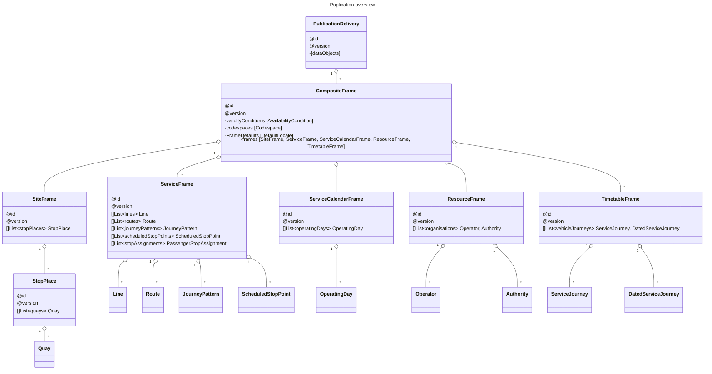

[Home](/README.md) / [Timetable_DatedServiceJourney](/04-Guides\) 

### Timetable using DatedServiceJourney
A description of the minimum information needed for a timtable using DatedServiceJourney as calendar

### PublicationDelivery:
<details open>
<summary>EPI Profile</summary>



</details>
<details>
<summary>Nordic profile</summary>

### Shared 

```mermaid
---
title: Puplication overview 
---

classDiagram
namespace Shared {
    PublicationDelivery "1" o-- "*" CompositeFrame
    class PublicationDelivery{
        @id
        @version
        -[dataObjects] 
    }
    class CompositeFrame{
        @id
        @version
        -validityConditions [AvailabilityCondition]
        -codespaces [Codespace]
        -FrameDefaults [DefaultLocale]
        -frames [ServiceFrame, ServiceCalendarFrame, ResourceFrame]
    }
}
namespace Line {
    PublicationDelivery "1" o-- "*" CompositeFrame
    class PublicationDelivery{
        @id
        @version
        -[dataObjects] 
    }
    class CompositeFrame{
        @id
        @version
        -validityConditions [AvailabilityCondition]
        -codespaces [Codespace]
        -FrameDefaults [DefaultLocale]
        -frames [ServiceFrame, TimetableFrame]
    }
}
namespace NSR {
    class SiteFrame{
        @id
        @version
        []List~stopPlaces~ StopPlace
    }
    SiteFrame "1" o-- "*" StopPlace
    class StopPlace{
        @id
        @version
        []List~quays~ Quay
    }
    StopPlace "1" o-- "*" Quay
}
```

The shared file is prefixed with underscore ("_")

- [dataObjects]
    - [CompositeFrame](/01-Frames/CompositeFrame.md)
        - [validityConditions] [AvailabilityCondition](/10-Objects/AvailabilityCondition.md)
        - [codespaces] [Codespace](/10-Objects/Codespace.md)
        - FrameDefaults
            - DefaultLocale
        - [frames]
            - [SiteFrame](/01-Frames/SiteFrame.md)
                - [stopPlaces] [StopPlace](/10-Objects/StopPlace.md)
                    - [quays] [Quay](/10-Objects/Quay.md)
            - [ServiceFrame](/01-Frames/ServiceFrame.md)
                - [scheduledStopPoints] [ScheduledStopPoint](/10-Objects/ScheduledStopPoint.md)
                - [stopAssignments] [PassengerStopAssignment](/10-Objects/PassengerStopAssignment.md)
            - [ServiceCalendarFrame](/01-Frames/ServiceCalendarFrame.md)
                - [operatingDays] [OperatingDay](/10-Objects/OperatingDay.md)
            - [ResourceFrame](/01-Frames/ResourceFrame.md)
                - [organisations] [Operator](/10-Objects/Operator.md)

### Line

- [dataObjects]
    - [CompositeFrame](/01-Frames/CompositeFrame.md)
        - [validityConditions] [AvailabilityCondition](/10-Objects/AvailabilityCondition.md)
        - [codespaces] [Codespace](/10-Objects/Codespace.md)
        - FrameDefaults
            - DefaultLocale
        - [frames]
            
            - [ServiceFrame](/01-Frames/ServiceFrame.md)
                - [lines] [Line](/10-Objects/Line.md)
                - [routes] [Route](/10-Objects/Route.md)
                - [journeyPatterns] [JourneyPattern](/10-Objects/JourneyPattern.md)
                    - [pointsInSequence] [StopPointInJourneyPattern](/10-Objects/StopPointInJourneyPattern.md)
            - [TimetableFrame](/01-Frames/TimetableFrame.md)
                - [vehicleJourneys]
                    - [ServiceJourney](/10-Objects/ServiceJourney.md)
                    - [DatedServiceJourney](/10-Objects/DatedServiceJourney.md)
</details>

### [DatedServiceJourney](/10-Objects/DatedServiceJourney.md)
The basic structure of a DatedServiceJourney provides a unique identifier, a reference to a [ServiceJourney](#ServiceJourney) and a single [OperatingDay](#OperatingDay) for this Journey.
There can be 1:* DatedServiceJourney to describe the calendar for a peraticular ServiceJourney

```xml
<DatedServiceJourney version="1" id="ENT:DatedServiceJourney:Planned_example">
    <ServiceJourneyRef ref="ENT:ServiceJourney:Example_1" version="1"/>
    <OperatingDayRef ref="ENT:OperatingDay:2025-03-06"/>
</DatedServiceJourney>
```
### [ServiceJourney](/10-Objects/ServiceJourney.md)
A ServiceJourney reference a [JourneyPattern](/10-Objects/JourneyPattern.md) describing the stopPattern through a network, and describing the passingtimes for each StopPoint in the JourneyPattern.
This ensures that JourneyPatterns can be reused by multiple Journeys

```xml
<ServiceJourney version="1" id="ENT:ServiceJourney:Example_1">
    <JourneyPatternRef ref="ENT:JourneyPatternRef:1"/>
    <passingTimes>
        <TimetabledPassingTime version="1" id="ENT:TimetabledPassingTime:1">
            <StopPointInJourneyPatternRef ref="ENT:StopPointInJourneyPattern:1"/>
            <DepartureTime>08:00:00</DepartureTime>
        </TimetabledPassingTime>
        <TimetabledPassingTime version="1" id="ENT:TimetabledPassingTime:2">
            <StopPointInJourneyPatternRef ref="ENT:StopPointInJourneyPattern:2"/>
            <ArrivalTime>09:00:00</ArrivalTime>
            <DepartureTime>09:02:00</DepartureTime>
        </TimetabledPassingTime>
        <TimetabledPassingTime version="1" id="ENT:TimetabledPassingTime:3">
            <StopPointInJourneyPatternRef ref="ENT:StopPointInJourneyPattern:3"/>
            <ArrivalTime>10:00:00</ArrivalTime>
        </TimetabledPassingTime>
    </passingTimes>
</ServiceJourney>
```
### [JourneyPattern](/10-Objects/JourneyPattern.md)
Describing the stopPattern and referencing [ScheduledStopPoints](#ScheduledStopPoints and StopAssignments) that connects the ServiceJourney with [Site](#Site) through the usage of [StopAssignments](#ScheduledStopPoints and StopAssignments)

```xml
<JourneyPattern version="1" id="ENT:JourneyPattern:1">
    <RouteRef ref="ENT:Route:1"/>
    <pointsInSequence>
        <StopPointInJourneyPattern version="1" id="ENT:StopPointInJourneyPattern:1" order="1">
            <ScheduledStopPointRef ref="ENT:ScheduledStopPointRef:A"/>
            <ForAlighting>false</ForAlighting>
            <ForBoarding>true</ForBoarding>
        </StopPointInJourneyPattern>
        <StopPointInJourneyPattern version="1" id="ENT:StopPointInJourneyPattern:2" order="2">
            <ScheduledStopPointRef ref="ENT:ScheduledStopPointRef:B"/>
            <ForAlighting>true</ForAlighting>
            <ForBoarding>true</ForBoarding>
            <RequestStop>true</RequestStop>
        </StopPointInJourneyPattern>
        <StopPointInJourneyPattern version="1" id="ENT:StopPointInJourneyPattern:3" order="3">
            <ScheduledStopPointRef ref="ENT:ScheduledStopPointRef:C"/>
            <ForAlighting>true</ForAlighting>
            <ForBoarding>false</ForBoarding>
        </StopPointInJourneyPattern>
    </pointsInSequence>
</JourneyPattern>
```
### [Route](/10-Objects/Route.md)
Intended usage is to give a high level description of the Journeys pattern using start location, destination and important via locations
Having a connection to the [Line](#Line)

```xml
<Route version="1" id="ENT:Route:1">
    <LineRef ref="ENT:Line:X"/>
</Route>
```
### [Line](/10-Objects/Line.md)
Multiple journeys with similar journeypatterns form a Line, this line can have a specific [Operator](#Operator) responsible for the service provided

```xml
<Line version="1" id="ENT:Line:X">
    <Name>X Line</Name>
    <PublicCode>X</PublicCode>
    <OperatorRef ref="ENT:Operator:X"/>
</Line>
```
### [OperatingDay](/10-Objects/OperatingDay.md)
Stating the Date connected to each OperatingDay object

```xml
<ServiceCalendarFrame version="1" id="ENT:ServiceCalendarFram:1">
    <operatingDays>
        <OperatingDay version="1" id="ENT:OperatingDay:2025-03-06">
            <CalendarDate>2025-03-06</CalendarDate>
        </OperatingDay>
    </operatingDays>
</ServiceCalendarFrame>
```
### [ScheduledStopPoint](/10-Objects/ScheduledStopPoint.md) and [StopAssignments](/10-Objects/PassengerStopAssignment.md)

```xml
<ServiceFrame version="1" id="ENT:ServiceFrame:2">
    <scheduledStopPoints>
        <ScheduledStopPoint version="1" id="ENT:ScheduledStopPoint:A">
            <Name>A</Name>
        </ScheduledStopPoint>
        <ScheduledStopPoint version="1" id="ENT:ScheduledStopPoint:B">
            <Name>B</Name>
        </ScheduledStopPoint>
        <ScheduledStopPoint version="1" id="ENT:ScheduledStopPoint:C">
            <Name>C</Name>
        </ScheduledStopPoint>
    </scheduledStopPoints>
    <stopAssignments>
        <PassengerStopAssignment order="1" version="1" id="ENT:PassengerStopAssignment:A">
            <ScheduledStopPointRef ref="ENT:ScheduledStopPoint:A" version="1"/>
            <QuayRef ref="NSR:Quay:A-1"/>
        </PassengerStopAssignment>
        <PassengerStopAssignment order="2" version="1" id="ENT:PassengerStopAssignment:B">
            <ScheduledStopPointRef ref="ENT:ScheduledStopPoint:B" version="1"/>
            <QuayRef ref="NSR:Quay:B-2"/>
        </PassengerStopAssignment>
        <PassengerStopAssignment order="3" version="1" id="ENT:PassengerStopAssignment:C">
            <ScheduledStopPointRef ref="ENT:ScheduledStopPoint:C" version="1"/>
            <QuayRef ref="NSR:Quay:C-1"/>
        </PassengerStopAssignment>
    </stopAssignments>
</ServiceFrame>
```
### Site ([StopPlace](/10-Objects/StopPlace.md) and [Quay](/10-Objects/Quay.md))

```xml
<SiteFrame version="1" id="ENT:SiteFrame:1">
    <stopPlaces>
        <StopPlace version="1" id="ENT:StopPlace:A">
            <quays>
                <Quay version="1" id="ENT:Quay:A-1"/>
            </quays>
        </StopPlace>
        <StopPlace version="1" id="ENT:StopPlace:B">
            <quays>
                <Quay version="1" id="ENT:Quay:B-1"/>
                <Quay version="1" id="ENT:Quay:B-2"/>
            </quays>
        </StopPlace>
        <StopPlace version="1" id="ENT:StopPlace:C">
            <quays>
                <Quay version="1" id="ENT:Quay:C-1"/>
            </quays>
        </StopPlace>
    </stopPlaces>
</SiteFrame>
```
### [Operator](/10-Objects/Operator.md)

```xml
<ResourceFrame version="1" id="ENT:ResourceFrame:1">
    <organisations>
        <Operator version="1" id="ENT:Operator:X">
            <CompanyNumber>12345678</CompanyNumber>
            <Name>X</Name>
            <LegalName>X AS</LegalName>
            <CustomerServiceContactDetails>
                <Email>no-reply@costumerservice.com</Email>
                <Phone>180-something</Phone>
                <Url>https://something.com</Url>
            </CustomerServiceContactDetails>
        </Operator>
    </organisations>
</ResourceFrame>
```
[XML Example](/04-Guides/XML/Timetable_DatedServiceJourney.xml)
